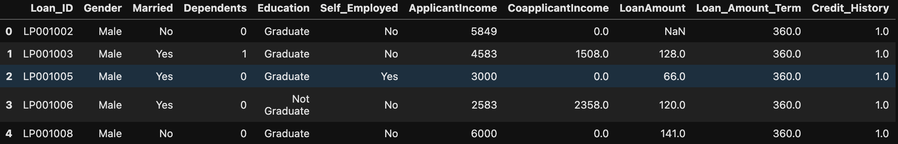
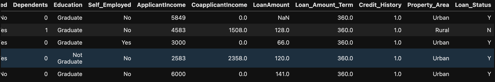
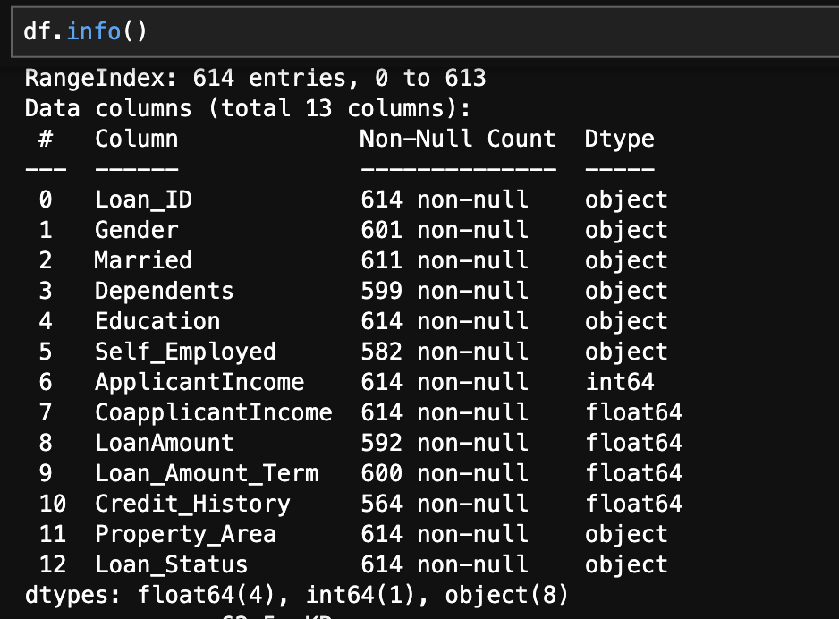
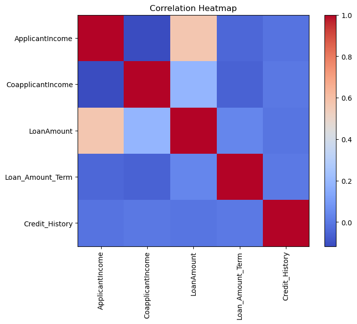
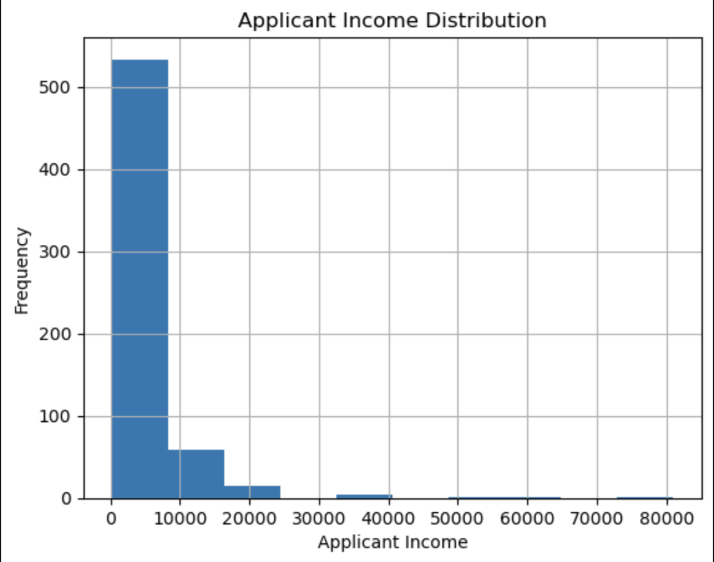
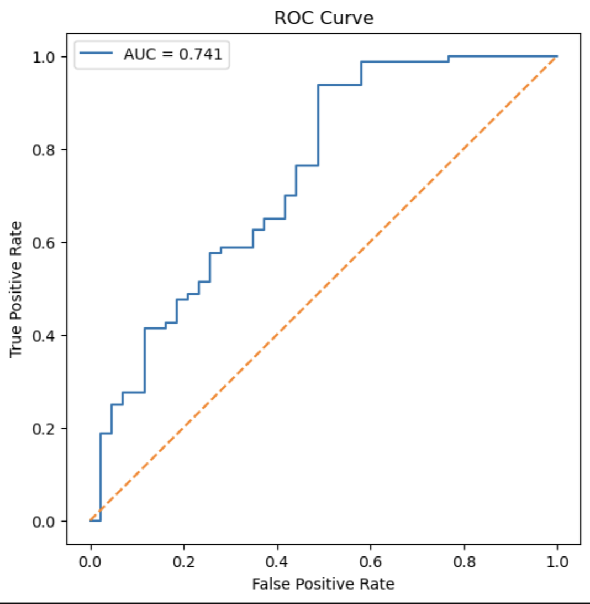

# 🏦 Loan Default Risk Prediction Lifecycle

An end-to-end **Machine Learning** project that predicts whether a loan application will be **approved or rejected** based on applicant information. This project demonstrates the complete data science lifecycle—from data preprocessing and exploratory data analysis to model building, evaluation, and interpretation.

---


---

## 📌 Project Objective

Banks receive thousands of loan applications, and evaluating each application manually is time-consuming and prone to inconsistencies.

The objective of this project is to build machine learning models that can predict loan approval status using historical applicant information and compare their performance using standard evaluation metrics.

---

## 📊 Dataset

**Dataset:** Loan Prediction Dataset

The dataset contains **614 loan applications** with applicant information including:

- Gender
- Marital Status
- Number of Dependents
- Education
- Self Employment
- Applicant Income
- Co-applicant Income
- Loan Amount
- Loan Amount Term
- Credit History
- Property Area

**Target Variable**

- **Loan_Status**
  - **1** → Loan Approved
  - **0** → Loan Rejected

---

# 🛠️ Project Workflow

```text
Dataset
    ↓
Data Cleaning
    ↓
Missing Value Treatment
    ↓
Exploratory Data Analysis
    ↓
Feature Engineering
    ↓
Encoding & Scaling
    ↓
Train-Test Split
    ↓
Model Building
    ↓
Model Evaluation
```

---

# 📈 Exploratory Data Analysis

## Dataset Overview





---

## Missing Value Analysis



---

## Correlation Heatmap



---

## Applicant Income Distribution



---

## ROC Curve

**AUC Score:** **0.741**



The ROC curve demonstrates that the model performs better than random guessing and achieves a moderate ability to distinguish between approved and rejected loan applications.

---

# 🤖 Machine Learning Models

The following classification models were implemented and compared:

- Logistic Regression
- Decision Tree Classifier
- Random Forest Classifier

---

# 📊 Model Performance

| Model | Accuracy |
|--------|----------|
| Logistic Regression | **78.86%** |
| Decision Tree | **78.05%** |
| Random Forest | **78.86%** |

---

## ⭐ Feature Importance

Feature importance analysis indicates that **Credit History** is the strongest predictor of loan approval, followed by applicant income and loan-related attributes.

---

# 📌 Key Insights

- Credit History is the most influential feature in determining loan approval.
- Applicants with stronger credit histories have a significantly higher chance of approval.
- Logistic Regression and Random Forest achieved similar predictive performance.
- Decision Tree showed comparatively lower generalization performance.
- Feature engineering using **TotalIncome** improved representation of an applicant's financial capacity.

---

# 🛠️ Technologies Used

- Python
- Pandas
- NumPy
- Matplotlib
- Scikit-learn
- Jupyter Notebook
- Git
- GitHub

---

# 📁 Repository Structure

```text
loan-default-risk-lifecycle/
│
├── data/
│   └── raw/
│       └── train.csv
│
├── images/
│   ├── applicant-income-distn.png
│   ├── correlation-heatmap.png
│   ├── data-overview1.png
│   ├── data-overview2.png
│   ├── info.png
│   ├── loan-status-vs-credit-history.png
│   └── roc-curve.png
│
├── notebooks/
│   └── loan-prediction-analysis.ipynb
│
├── requirements.txt
├── .gitignore
├── LICENSE
└── README.md
```

---

# 🚀 Installation

```bash
git clone https://github.com/vanshikha2212-prog/loan-default-risk-lifecycle.git

cd loan-default-risk-lifecycle

pip install -r requirements.txt
```

---

# ▶️ Running the Project

Launch Jupyter Notebook:

```bash
jupyter notebook
```

Then open:

```text
notebooks/loan-prediction-analysis.ipynb
```

---

# 🚀 Future Improvements

Potential improvements for future iterations of this project include:

- Hyperparameter tuning using GridSearchCV
- Cross-validation
- XGBoost and LightGBM models
- Probability threshold optimization
- Model deployment using Streamlit or Flask
- Explainable AI using SHAP values

---

# 📚 Learning Outcomes

Through this project, I gained practical experience in:

- Exploratory Data Analysis (EDA)
- Data Cleaning
- Missing Value Treatment
- Feature Engineering
- Feature Encoding
- Feature Scaling
- Binary Classification
- Logistic Regression
- Decision Trees
- Random Forests
- Model Evaluation
- ROC Curve & AUC Analysis
- Feature Importance Interpretation
- Git & GitHub for project version control

---

# 👩‍💻 Author

**Vanshikha Kandregula**

B.Sc. Applied Statistics & Data Science  
Symbiosis Statistical Institute

GitHub: **https://github.com/vanshikha2212-prog**